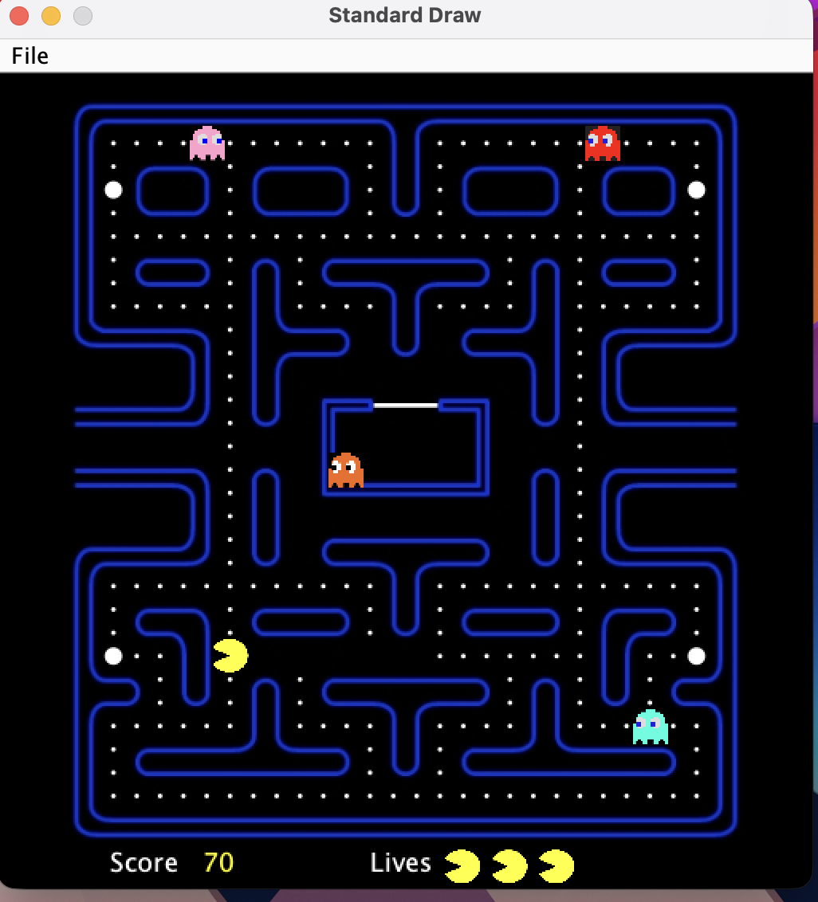
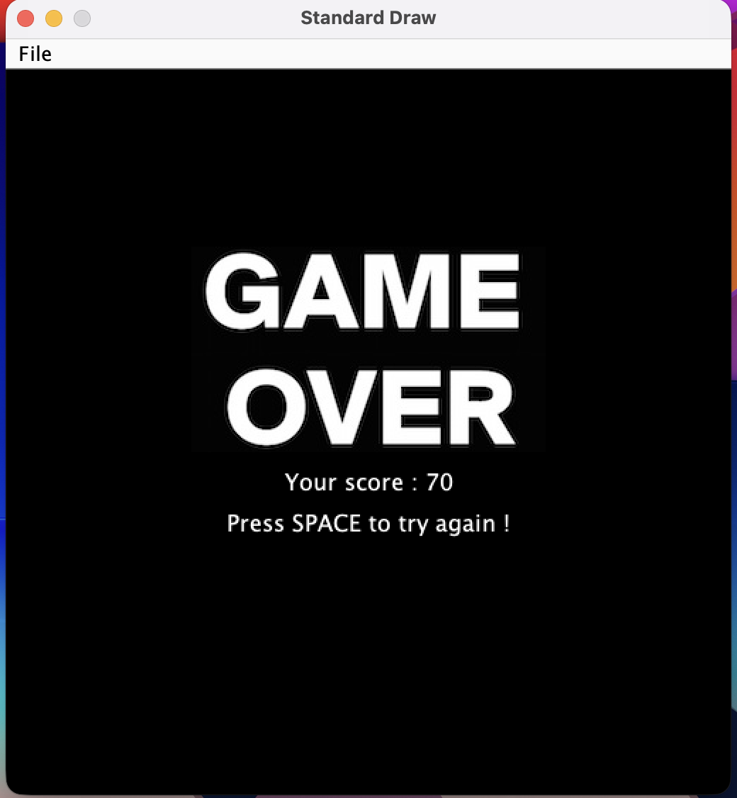

# 🟡 Pac-Man Game

A Java implementation of the classic Pac-Man arcade game featuring authentic ghost AI behavior, proper game state management, and clean object-oriented architecture.


## Features

- Original arcade ghost AI with unique personalities (Blinky, Pinky, Inky, Clyde)
- Tunnel wrapping, ghost prison with staggered release
- Responsive controls with direction buffering
- Score tracking, multiple lives, win/lose conditions

## Architecture

The project follows a layered architecture with clear separation of concerns:

```
Game (Orchestrator)
├── Renderer (Facade over StdDraw)
├── CollisionDetector (collision logic + combo scoring)
├── GhostModeManager (timer-based state machine)
├── Player (input, movement, score)
├── Ghost (prison logic, delegates AI to strategy)
│   └── TargetingStrategy (interface)
│       ├── BlinkyStrategy (direct chase)
│       ├── PinkyStrategy (ambush - 4 tiles ahead)
│       ├── InkyStrategy (flanking vector)
│       └── ClydeStrategy (shy - chase/retreat)
├── GameBoard (maze state, pellet tracking)
├── Direction (enum with movement vectors)
└── GhostMode (enum: CHASE, SCATTER, FRIGHTENED)
```

## Ghost

Ghosts use **greedy best-first pathfinding** with single-step lookahead (matching the original 1980 arcade):

Each ghost calculates its target differently:
- **Blinky (Red):** Targets Pac-Man's exact tile
- **Pinky (Pink):** Targets 4 tiles ahead of Pac-Man
- **Inky (Cyan):** Uses vector from Blinky to create flanking position
- **Clyde (Orange):** Chases when far (>8 tiles), retreats to corner when close

## How to Run

### Prerequisites
- Java JDK 8+
- Princeton's stdlib library (included in `lib/`)

### Compile and Run
```bash
cd src
javac -cp ../lib/stdlib-package.jar Pacman/*.java
java -cp .:../lib/stdlib-package.jar Pacman.Game
```

### Controls
- **Arrow Keys:** Move Pac-Man
- **Space:** Start game / Restart after game over

## Game Mechanics

- **Pellet:** 10 points
- **Power Pellet:** 50 points + ghosts turn blue (frightened)
- **Eating Ghosts:** 200 → 400 → 800 → 1600 (combo resets per power pellet)
- **Lives:** 3
- **Win:** Eat all pellets
- **Lose:** Lose all lives

## Project Structure

```
src/Pacman/
├── Game.java               Game loop and orchestration
├── Character.java          Abstract base (position, movement)
├── Player.java             Input handling, score, lives
├── Ghost.java              Prison logic, direction selection
├── TargetingStrategy.java  Interface for ghost AI
├── BlinkyStrategy.java     Direct chase
├── PinkyStrategy.java      Ambush (4 tiles ahead)
├── InkyStrategy.java       Flanking vector
├── ClydeStrategy.java      Shy (chase/retreat)
├── GameBoard.java          Maze state, tile access
├── GhostModeManager.java   CHASE/SCATTER/FRIGHTENED state machine
├── GhostMode.java          Mode enum
├── Direction.java          Direction enum with dx/dy
├── CollisionDetector.java  Collision + combo scoring
├── Renderer.java           All rendering (StdDraw facade)
├── MathUtil.java           Distance calculation
└── Maze.java               Static maze data
```

## Screenshots

### Gameplay


### Game Over

